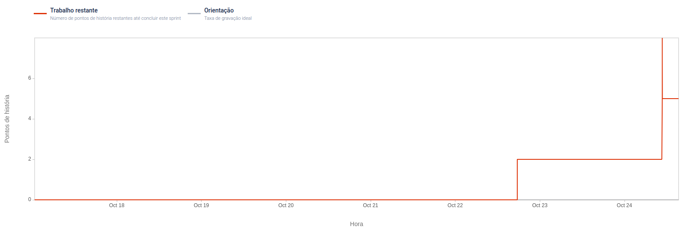

# Sprint 1

**From**: 17/10/2022

**To**: 24/10/2022

**Scrum Master:** João Reis	

**Product Owner:** João Farias

**Developers:** Artur Romão, João Farias, Mariana Rosa

## Sprint Planning

In our second week of development, the actual first sprint, the goals are the following: 
* User story: "As Teresa, I want to check on my property's information" (3 points)
* Develop client's frontend
* Build Site's Management API
* Connect the two modules in order to present information to client, such as, their properties, the intrusion's history and the devices present in their properties. 

Story Points Estimated: 3

## Sprint Review

Although, **frontend** was developed **successfully**, unfortunately backend module wasn't. Our modulation suffered some changes during the sprint, and we had to modulate our backend module several times which made us lost a bit of time. However, 2 of 3 goals where accomplished and the user story was delivered. 

Story Points Delivered: 3

## Sprint Retrospective 

 - What went well? We improved from the previous sprint by splitting the tasks into smaller ones and work towards one goal together

- What could be improved? More communication between the team, we had some problems because of that.

- What went badly? Nothing serious. 

#### Burndown Chart
