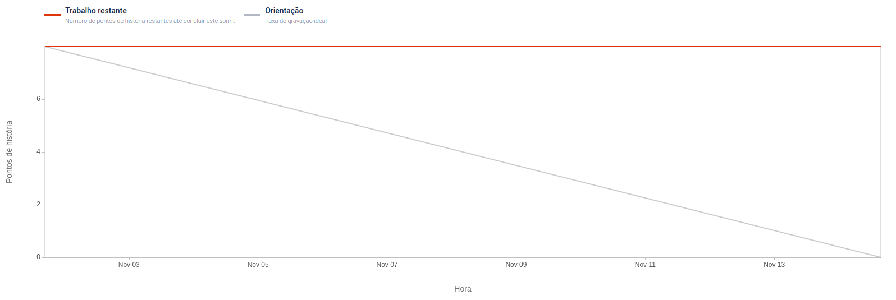

# Sprint 3

**From**: 1/11/2022

**To**: 13/11/2022

**Scrum Master:** Mariana Rosa

**Product Owner:** Ricardo Rodriguez

**Developers:** Artur Romão, João Farias, João Reis

## Sprint Planning

In the third sprint we were expecting to complete the following user story from the previous sprint: "As Teresa, I want to be notified when an intrusion occurs in my business, so that I can allow myself to be more comfortable and feel safe about my investment." (5 points)

To do so we need to have this Sprint Goals:

* To  Finish API Sites Management
* Store Intrusions in DataBase, when **HDM** detects it
* Intrusion API communicate with Notifications API, through API Gateway
* Intrusion API asks for video frames to camera API and this module answers through rabbit mq
* Intrusion API joins the received frames in a video and send it to AWS S3.

Story Points Estimated: 5

## Sprint Review

This sprint was not one of the bests, multiple reasons why. However, the fact that the API Sites Management was pratically done was a great thing and the two API can already comunicate and send video to AWS.

Story Points Delivered: 0

## Sprint Retrospective 

 - What went well? Important goals reached.

- What could be improved? Better time management.

- What went badly? The team had a lot of other work from other courses.

#### Burndown Chart
