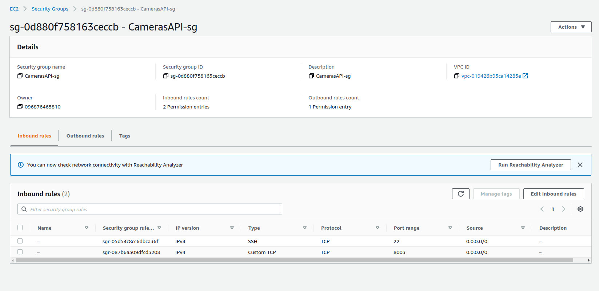

# AWS 

As previously referred in the [Project Presentation](https://es-docusaurus-documentation.netlify.app/docs/hello/), this project has several modules and different technologies. In the course *Software Engineer*, one of the focus is to explore Amazon Web Services (AWS).  

AWS is a cloud computing platform offered by Amazon.com. It provides a range of services including computing, storage, networking, database, analytics, machine learning, security, and more. These services can be used to build, deploy, and run applications, websites, and other services.

The services offered by this company are used by a wide range of organizations, including small businesses, enterprises, and government agencies, to build and run their applications and services. It is known for its reliability, security, and scalability, and has a large ecosystem of tools and services that can be used to build, deploy, and manage applications on the platform.

AWS is extremely popular nowadays because it offers a pay-as-you-go pricing model, which means the users only pay for the resources they want. It's very sustainable for companies to rent equipment from Amazon, since buying them individually would be much more expensive. An interesting fact, is that with the rising growth of this services, the cost reduce worldwide, since more people using meaning more profit to the company. AWS has lower the prices since it's beginning because of that, which is great for everyone.

## AWS Cloud Architecture

## Application Load Balancer

The AWS Application Load Balancer is responsible for listening to user requests on port 80 and route them to the correct target group, according to the URL path. The figure below depicts the three rules for the ALB that forward the request to the correct target group:

## Target Group

There are three target groups associated with the project's load balancer and each one of the target groups has a registered container instance mapping to the correct port and a health check path so that the ALB can know if the task/container is alive for request routing.

### client-web-ui-tg

### intrusion-api-tg

### sites-management-api-tg

## Security Groups

For security purposes, we created different security groups for different microservices and AWS services to control the inbound traffic. 

Besides the security groups for the modules of this project, we also have a security group to allow access to AWS ElastiCache for Redis from the Human Detection Module, two security groups for traffic between AWS RDS PostgreSQL instance and the Sites Management API and, finally, a security group that allows HTTP traffic on port 80 from everywhere.

### Application Load Balancer Security Group

### Client Web UI Security Group

### Manager Web UI Security Group

### Intrusion Management API Security Group

### Sites Management API Security Group

### Cameras API Security Group

### EC2 to RDS Security Group

### RDS to EC2 Security Group

### Redis Security Group

## Microservice Deployment

These are the steps we took in the initial steps of the project's deployment in AWS:

- Create ECR repository for the microservice and push the latest image;	

- Create an EC2-compatible task definition in AWS ECS with a container that runs the previously created image and specify the correct port mappings; 

- Create a cluster in the project's VPC with two EC2 t2.micro instances in two subnets located in different availability zones (eu-west-3a and eu-west-3b) and the correct security group (already configured);

- Create an ECS service with the correct task definition with two tasks;

- Associate the container to the AWS Elastic Load Balancer (in the correct listener port, with the correct target group, path pattern and health check path)

- Set auto-scaling with a minimum of 2 tasks, maximum of 4 tasks and 2 desired tasks;

  
However, spreading different microservices around two availability zones with two EC2 containers for each cluster will end up surpassing the 750-hour EC2 instances free-tier limit and we couldn't stop the auto-scaling group when we were not using the EC2 instances. We ended up getting an expensive AWS bill and we needed to terminate all services in order to get the refund.

Thus, we created another AWS account for the project and tried a different approach:

- Create ECR repository for the microservice and push the latest image;	
- Create an EC2-compatible task definition in AWS ECS with a container that runs the previously created image and specify the correct port mappings;
- Create a cluster in the project's VPC with one EC2 t2.micro instance in only one availability zone and with the correct security group (already configured);
- Create an ECS task with the correct task definition;
- Register the EC2 instance with the correct port to the AWS Elastic Load Balancer;

Although this is not the ideal scenario in an enterprise project, we know how to create a robust AWS architecture as we were constantly learning new things on AWS. We already created a project with ECS services distributed between two availability zones with appropriate subnet and security group settings.

  