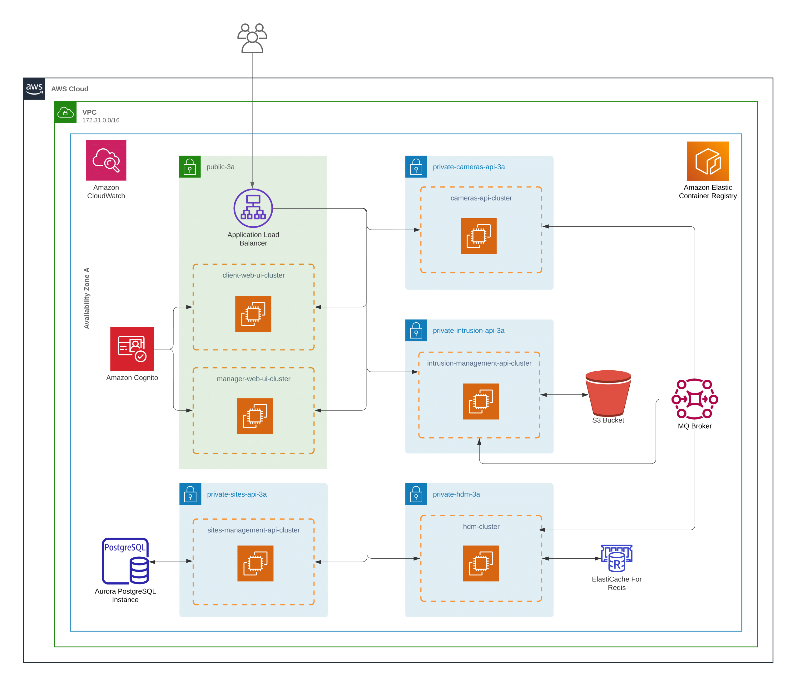

# AWS Cloud Architecture

As previously refered in the [Project Presentation](https://es-docusaurus-documentation.netlify.app/docs/hello/), this project has several modules and diferent technologies. In the course *Software Enginner*, one of the focus is to explore Amazon Web Services (AWS).  

AWS is a cloud computing platform offered by Amazon.com. It provides a range of services including computing, storage, networking, database, analytics, machine learning, security, and more. These services can be used to build, deploy, and run applications, websites, and other services.

The services offered by this company are used by a wide range of organizations, including small businesses, enterprises, and government agencies, to build and run their applications and services. It is known for its reliability, security, and scalability, and has a large ecosystem of tools and services that can be used to build, deploy, and manage applications on the platform.

AWS is extremely popular nowadays because it offers a pay-as-you-go pricing model, which means the users only pay for the resources they want. It's very sustainable for companies to rent equipment from Amazon, since buying them individually would be much more expensive. An interesting fact, is that with the rising growth of this services, the cost reduce worldwide, since more people using meaning more profit to the company. AWS has lower the prices since it's beginning because of that, which is great for everyone.

