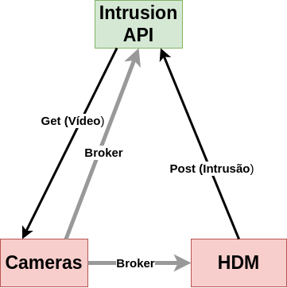

# Backend

For the back-end, our team decide to explore the framework [FastAPI](https://fastapi.tiangolo.com/). FastAPI is an open-source Python web framework for building APIs (Application Programming Interfaces). It is designed to be easy to use and to provide high performance.

One of the main advantages that led us to choose it is its fast development speed. It uses automatic documentation, which is generated from the code, and includes features such as validation, serialization, and routing. This makes it easier for developers to build APIs quickly and with fewer errors.

FastAPI is also highly efficient. It is built on top of the latest version of the asyncio library, which allows it to handle a large number of concurrent connections. In addition, FastAPI includes built-in support for web servers such as Uvicorn and Hypercorn, which can further improve the performance of an application.

Although, none of the members had work with it, learning something new and useful as this framework added value to our programming skills. Of course, it had some less favorable aspects like taking time to learn it and to debug, but it was worth it. 

completarrrr!!!

