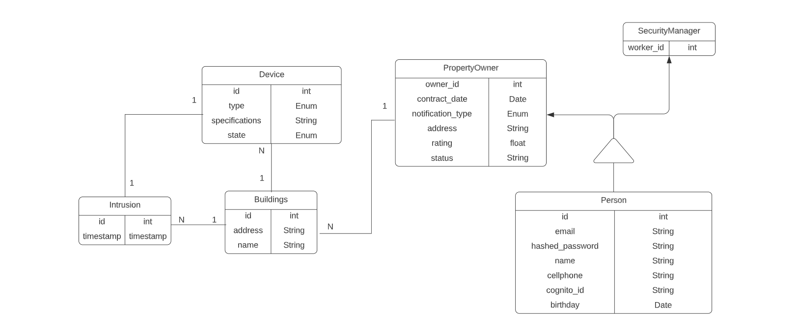

# Backend Sites Management API

The information model of the Sites Management API was designed in this way:

The **Person** class represents a person, and has columns for storing personal information such as name, email, hashed password, address, and cellphone. It also has a *cognito_id* column, store an identifier for a user within an Amazon Cognito.The Person class has two subclasses: **SecurityManager** and **PropertyOwner**.

The **SecurityManager** class represents a security manager and has a worker_id column that is a foreign key referencing the id column of the Person table. 

The **PropertyOwner** class represents a property owner and has a *property_owner_id* column that is a foreign key referencing the id column of the Person table. It also has a *contract_date* column for storing the date of the property owner's contract, a *notification_type* column for storing the type of notifications the owner prefers to receive, and a relationship with the Person class. The PropertyOwner class has a buildings attribute that represents the buildings owned by the property owner.

The **Building** class represents a building and has columns for storing the building's address, name, and the id of the property owner. It also has relationships with the **Device** and **Intrusion** classes.

The **Device** class represents a device and has columns for storing the device's specifications, state (which is an enumerated type that can be *ON*/*OFF*), type (which is also an enumerated type that can be *CAMERA*/*SENSOR*), and the id of the building it is associated with. It has a relationship with the **Building** class, to indicate that the Building class has a corresponding devices attribute that points back to Device objects.

The **Intrusion** class represents an intrusion detected by the security system and has columns for storing the timestamp of the intrusion and the id of the building and device involved. It has a relationship with the Building class to indicate that the Building class has a corresponding intrusions attribute that points back to Intrusion objects.
