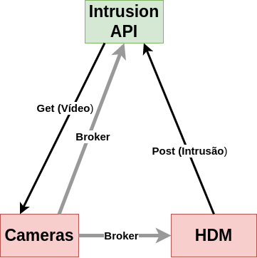

# Human Detection Module

The image below describes one of the most important parts of out system.

1. The cameras module will send the video frames to HDM through RabbitMQ and this one is going to process them.
2. If an intrusion is detected, this API is going to post the intrusion in Intrusion API.
3. Once the intrusion is posted, the Intrusion API will ask the cameras API for the video frames
4. The cameras API will send the frames through RabbitMQ and the intrusion API module will concatenate all frames and process the video created.
