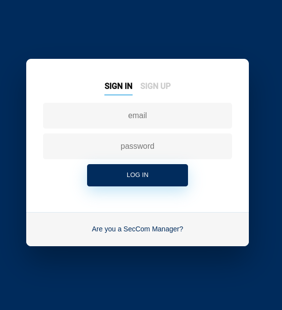

# Website Manager UI

The Frontend Manager is a simple and intuitive system. 
It has several pages:

### Login/Sign in Page

The manager can login or sign in. If he doesn't have an account, he can click on the "Sign in" button and then he will be redirected to the sign in page.

### Client page

The manager can see the list of clients and their information. Is it possible to search for name, email or even cellphone number. The Manager cal also sort the rows that he wants by clicking on the name of the columns. 

### Intrusion page
Here is reunited all of the intrusions that occurred to his clients. A intrusion is characterized by the timestamp, the device that was triggered and of course, what property did it occurred. It is also possible to download them. This table has the same filtering/sorting characteristic that the client page has. 

