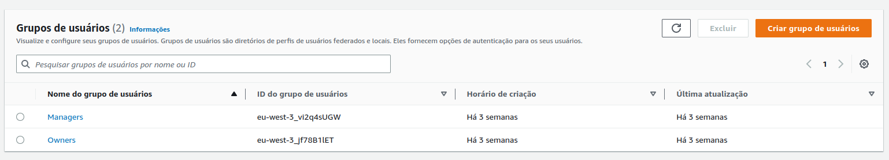

# Identity Provider (IDP)

An identity provider (IdP) is a system that creates, stores, and manages digital identities. Basically, an IDP offers user authentication as-a-service.

Initially, we decided to use Keycloak as Identity Provider. We tried to implement this tool in our project along two sprints, but without success. 
So, something has to change! Through the Software Engineering classes and after talking to other groups, the change we made was the tool, we decided to use **AWS Cognito**.

## AWS Cognito

Amazon Cognito is a cloud service that provides authentication, authorization, and user management for web and mobile applications. It is designed to allow developers to easily add user sign-up, sign-in, and access control to their applications.

Cognito provides several features, but we are using **User pools**.

**But what is a User Pool?** User pools allow developers to manage and authenticate users for their applications. They can create and customize the sign-up and sign-in experience, as well as handle tasks such as password recovery and multi-factor authentication.

So we created two user pools: Managers and Owners, as we can see in the next image.

Some configurations of this user pools:
* the interface of login/signin is created by us
* the user needs to verify his email to create a valid account.
* the user needs to indicate his address, cellphone, name and birthday to could create an account.
* there are a password security level: require numbers, special character, capital letters, lowercase letters and a minimum size of eight letters.
* the multifactor authentication is disabled