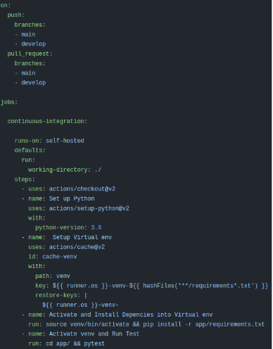
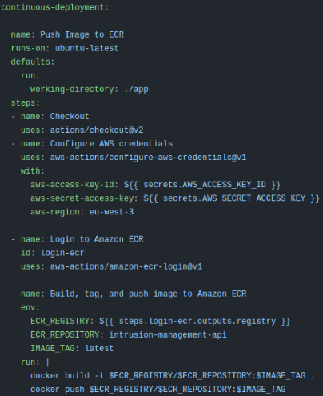

# Continuous Integration/Continuous Deployment

In order to implement CI/CD, we used GitHub Actions. We have a pipeline for each of the modules, and each has two different jobs, one for Continuous Integration and the other for Continuous Deployment.

## Continuous Integration
For CI, we have a job that runs every time a push or a Pull Request is made to the main or develop branches. This job basically installs the dependencies that we need for the project and would run the tests, but since we didn't have any tests, we only create a virtual environment and install the dependencies.

## Continuous Deployment
For CD, we have a job that runs every time a push is made to the main or develop branches. This job basically builds the Docker image of the module and pushes it to the correspondent AWS ECR repository.

