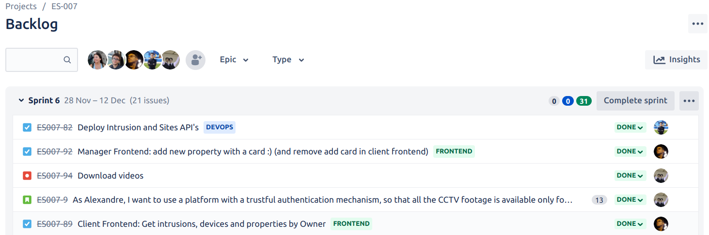
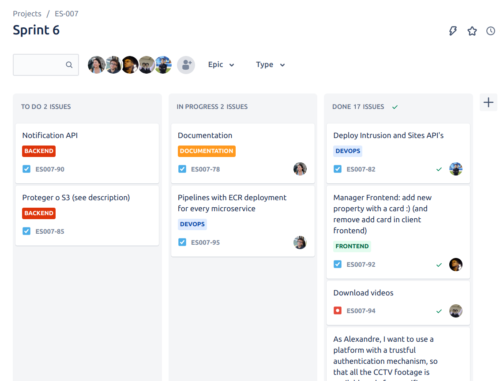
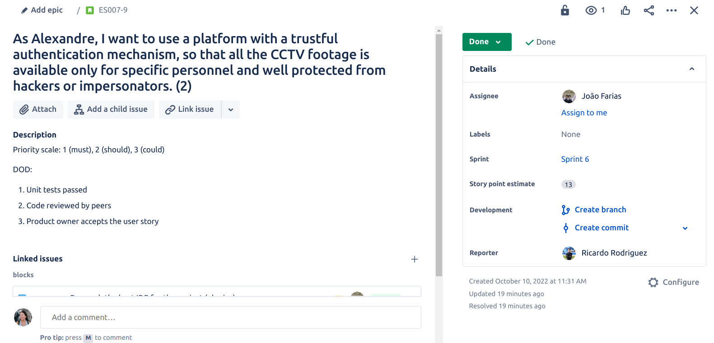
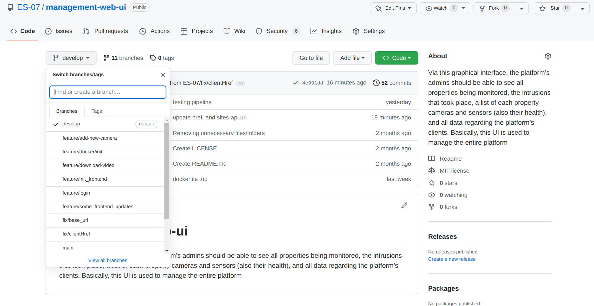
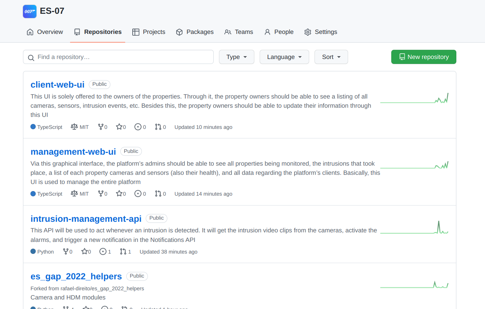
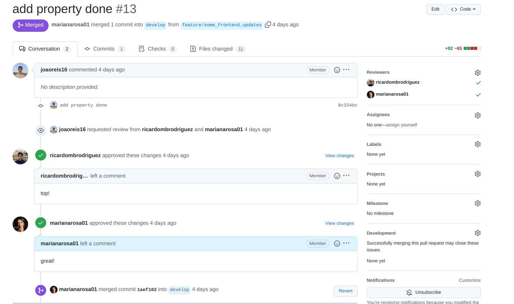
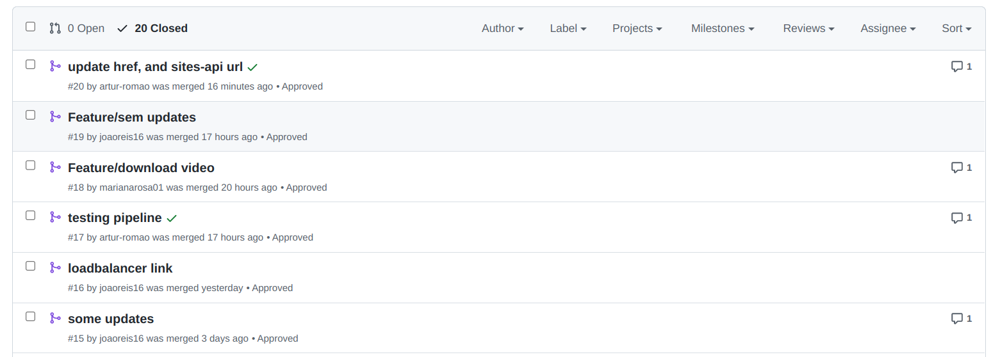

# Development Workflow

## Jira 

For the workflow of this project we used [Jira Software](https://www.atlassian.com/software/jira) to keep track of our sprints and assigned tasks. We have every other day meetings to check what every member of the team have developed, what difficulties they are overpassing and which user stories and tasks have higher priority in that moment, besides the initial user story prioritization. We also intend to do Pull Requests for each developing feature during our meeting, therefore we can always have the code merged, organized and that everyone is aware of what is being done. For each feature on our applications, a new branch will be created.

On the board it goes the products in the [backlog](https://bernas04.atlassian.net/jira/software/projects/ES007/boards/2/backlog). There has a list of features, issues, and tasks that are planned for development but have not yet been worked on. It represents the team's to-do list, and can be used to prioritize and plan work. Typically is managed by the product owner or the project manager, who is responsible for prioritizing the items in the backlog and making sure that they align with the overall goals of the project. The team then picks items from the backlog and moves them into the [board](https://bernas04.atlassian.net/jira/software/projects/ES007/boards/2), where they are worked on and eventually marked as complete. This a very important tool for managing work in an agile development process, as it allows the team to focus on the most important items first and adapt to changing priorities as the project progresses.

We adopted three possible states for the Jira tasks as suggested by the software:
* **To do** - whenever a task was merely discussed and defined by the team and no work has been done yet;
* **In progress** - during the development of the task or when it has been finished but is waiting for tests and deployment (this requires team communication);
* **Done** - when the task meets the requirements of DoD (Definition of Done).

The information about each User Story can be found on Jira. The person who is responsible for it, prioritization, the story points estimate and the DoD.

Each one of those tasks is focused on the development of a certain feature of an user story. In terms of development, a branch was created in GitHub for each Jira feature so that the work remains organized and easy to follow and track. 

Whenever the development of a task is completed (regarding the Definition of Done), and all tests are passing, a deploy to a staging environment and to a production environment is done, via *GitHub Actions* pipeline. 

## GitHub Workflow

An organization was created for this project, since we had a lot of different modules. Each module was created on a different repository. In this way, the code is much more organized.

### Code Review

When it comes to code review, we defined that for each Pull Request, there should be at least one reviewer apart from the element that started the Pull Request.

### Pull Requests

Regarding branch protection rules, we decided to lock Pushes for both “develop” and “main” branches in order to prevent unwanted errors/problems (in case someone forgot to create a branch to develop a feature). Therefore, pull requests are a very regular action. Every once in a while, a Pull Request is made from the "develop" branch to the "main" branch in order to maintain a stable version of the module.

