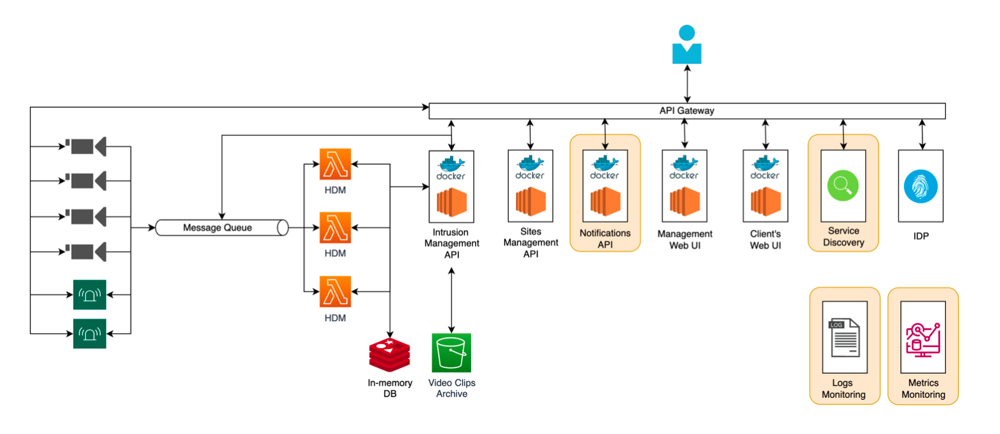

# Human Detection in CCTV Systems

## Group Assignment Project

This project will be based on the development of a software solution for a security company named
SecCom. SecCom is a security company that ensures critical buildings are not broken into, through the
installation and operation of CCTV cameras on-premises.Although, SecCom is still not foresting the technological advancements in the security monitoring field, having several people monitoring the cameras of the most critical buildings.

The goal of our team is to help SecCom with their transition to the digital world, creating an
automatic system that can identify intruders without human-intervention and act accordingly.
With their digital transition, SecCom will also install several light and sound alarms on the spaces
they are protecting and wishes for them to be automatically activated every time an intruder is
detected. Besides this, SecCom also expects that your team develops a top-to-bottom solution they
can use manage the cameras and alarms installed on-premises and to manage all their clients and
buildings monitored.

## Architecture

The architecure of the solution will be the follow: 

### Technologies
| Module | Technology |
| --- | --- |
| Cameras | Python  |
| Message Broker | RabbitMQ |
| Human Detection Module (HDM) | Python + Redis |
| Intrusion Management API | FastAPI + Docker + AWS S3 |
| Sites Management API | FastAPI + Docker + PostgreSQL |
| Notifications API | FastAPI + Docker  |
| Management’s Web UI | Angular + Docker |
| Client’s Web UI | Angular + Docker |
| Service Discovery | AWS CloudMap |
| IDP | AWS Cognito |
| Logs Monitor | ELK Stack |
| Metrics Monitor | Prometheus + Grafana |

### Details about the modules 
Responsible for sending the video frames to the message queue so it can be consumed by the Human Detection Module. It should receive requests from the Intrusion Management API to send the video clips of a detected intrusion.

#### **Message Broker**

The message queue is responsible for asynchronous communication between some microservices in this project.
Exchanges between the Cameras and HDM, HDM and Intrusion Management API, Intrusion Management API and Cameras.

#### **Human Detection Module**

This module analyzes the frames sent by the security cameras, to detect if there are humans on-site or not. It receives the camera frames from the message broker and uses machine learning to detect intrusions. When an intrusion is detected, the human detection module publishes a message to the message broker so it can be consumed by the intrusion API. This module also has a Redis in-memory database responsible for temporary storage of each frame (number of the frame, number of detected humans, timestamp, camera identifier, etc.).

The HDM is automatically scalable on demand using AWS Elastic Container Service, meaning the resources are scaled to handle the required capacity.

#### **Intrusion Management API**

This API will be used to act whenever an intrusion is detected. It will get the intrusion video clips from the cameras, activate the alarms, and trigger a new notification in the Notifications API. The requested video clips of the intrusions are stored in a AWS S3 database. 

#### **Sites Management API**

This API should be used to track all properties being monitored, along with all the logic regarding the “owners” of each property. It should make available endpoints for the creation/update/deletion of new properties, creation/update/deletion of new property owners, creation/update/deletion of new cameras/sensors and the creation of new intrusions (timestamp, number of detected humans, building/camera identifier, etc.).

This microservice contains a centralized relational database in PostgreSQL responsible for storing all the information of the entities described above in the endpoints last paragraph.

#### **Notifications API**

This API is responsible for informing the property owners and the police whenever an intrusion is detected, which is sent by the Intrusion Management API. The notification can be done via *email* or via telephone message. 

#### **Management Web UI**

Via this graphical interface, the platform’s admins should be able to see all properties being monitored, the intrusions that took place, a list of each property cameras and sensors (also their health), and all data regarding the platform’s clients. Basically, this UI is used to manage and supervise the entire platform.

#### **Client's Web UI**

This UI is solely offered to the owners of the properties. Through it, the property owners should be able to see a listing of all cameras, sensors, intrusion events and other information related to their buildings. Besides this, the property owners should be able to update their information through this UI.

#### **Service Discovery**

Every time a new camera or sensor is added to a property, the camera/sensor should register itself in the Service Registry, listing how it can be accessed. New devices information should be stored in the Sites Management API centralized database.

#### **IDP**

The IDP provides authentication and authorization mechanisms for all the aforementioned APIs and UIs. A non-authenticated user should not be able to perform operations in the entire platform.

#### **Logs Monitor**

All system logs should be centralized in this entity.

#### **Metrics Monitor**

All system metrics should be centralized in this entity.

Group 007  
Software Engineering