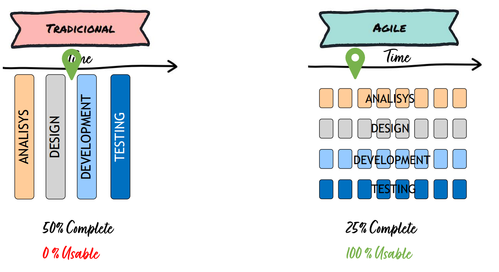

# Lessons Learned

## Agile and Development Workflow 

It was the first time we faced such a complete and complex project like this one. The amount of user stories and tasks that needed to be implemented in order to create a good product required a good software development strategy and Agile is the solution to this problem. We've already learned about the Agile methodology before taking this class. However, we have never applied the learned theory in a real-world project like this, which allowed us to expand our knowledge on Agile and to be familiarized with one of the best working methodologies that is absolutely necessary in today's world.

In the firsts sprints, we had the traditional mentality (the left side of the image) but in the last sprints we achieved with the **AGILE** mindset. The most important is to slice the project in a very granular way, to focus in each of these parts and show these increments to customers, because they are paying for something and they want to see progress. The group in the beginning did not have the mindset for a company, but this totally changed, being our goal to please the stakeholders in the Sprints Review and to delivery working features.

What we've learned or what we could improve in the future:

- Use a better story point range. We've faced some challenger when estimating points for a user story since the 1-5 scale is not wide enough to allow a better comparison between user stories' complexity. In the future, we would like to use bigger scale like 1-12 or 1-21.
- Daily scrums allow the project members to have a better insight of the state of the project and they give constant updates from all members
- It's very important to allow an impartial story point estimation from different members of the team and, most importantly and typically ignored, let the outlier member explain why he gave such a different estimate than the others
- It's important to update the Jira tasks when they are in progress or ready, so that the Scrum Master and the rest of the team can know if the spring goal is going to be achieved or not
- It's very important to follow all requirements of the Definition of Done, since not doing it only creates technical debt for the future and problems will arise

And in relation to development worflow: 

- We consolidated the need to give good and evident names for Git branches
- We should delete branches when the pull request is merged (this could be improved, although it's not 100% urgent)
- We learned to protect the main branches (master, develop) with branch protection rules that require a pull request before merging. This avoids errors, conflicts and bad code since all pull requests must have a minimum of 1 approval before merging. However, we often required the approval of 2 members in order to merge the pull request and this is an advantage since we can read others code, expand our knowledge about the entire system and improve the code when aiming for efficiency and clean code.

## AWS

AWS was our biggest challenge for this project. None of us had previous experience and, thought time, we understood that creating a robust system in the cloud from scratch would not be an easy task. We had to learn a lot of concepts from the classes and it was very difficult to connect different AWS services. However, trial and error worked for us because we think we have a solid knowledge of the most important AWS services, such as EC2, ECS, ECR, S3, RDS, VPC, IAM, Cognito and others, that will make the difference in our future as professionals.

What we've learned or what we could improve in the future:

- Consolidated our knowledge on network concepts, like subnets and internet protocols
- Understand how different systems are deployed in the internet (we had no idea how it was done previously)
- Consolidated our knowledge on system security: security groups are very important to control traffic around the system and protect our microservices, AWS IAM is a must to give the minimum privilege for resources/accounts
- Since we had to shutdown every AWS service one time (80$ bill), we already know how to configure different AWS services
- We learned the basics about Terraform and we would like to use it on the future
